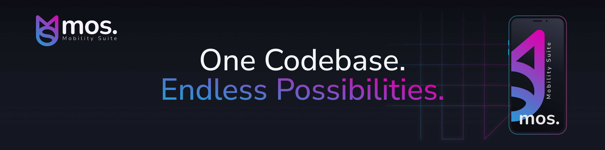
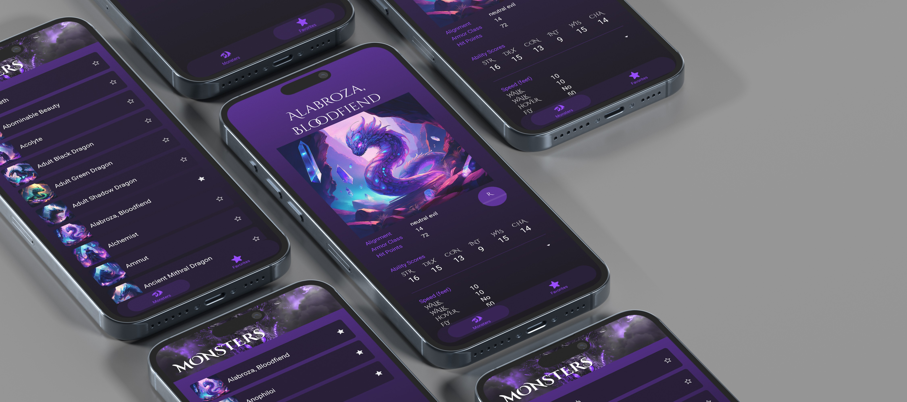

# 📱 Mobility Suite mos. Tutorial App

<table>
<tr>
<td width="60%" valign="top">

As part of [mos.academy](https://academy.mobilitysuite.de/), the **Tutorial App** will demonstrate how to create applications using the **mos.** technology.</br>Here, learners can find a step-by-step guide leading them through the development process. 

> [!IMPORTANT]
> This project is a tutorial app only. It is **not intended for production use** or app store distribution.

</td>
<td width="40%" valign="middle">

<div align="center">

### 📚 Table of Contents

| Section | Description |
|--------|-------------|
| [Mobility Suite mos.](#-powered-by-mobility-suite-mos) | Core platform powering the app |
| [App Overview](#-app-overview) | High-level summary |
| [Lesson Progression](#-lesson-progression) | Lesson Versioning |

</div>

</td>
</tr>
</table>

## 🚀 Powered by Mobility Suite mos.

<p align="center">
  
</p>

<p align="center">
  <a href="https://mobilitysuite.de/">Home Page</a> |
  <a href="https://documentation.mobilitysuite.de/">Documentation</a> |
  <a href="https://academy.mobilitysuite.de/">Academy</a>
</p>

<p align="center"><strong>Mobility Suite mos.</strong> is a low-code framework for the development of native and cross-platform apps.<br>
Solution that provides tools to accelerate development and reduce it's complexity, enabling faster deployment <br>and easier maintenance with minimal coding expertise required.</p>

## 📖 App Overview

This tutorial app demonstrates a variety of **mos**. features in a version-based project.
With this project, users will learn the fundamentals of **mos.** development - from adding UI components and translations to building layouts, connecting to databases, and integrating queries. Each lesson introduces new concepts and features, allowing learners to gradually build up their skills.

<p align="center">
  
</p>

## 🧩 Lesson Progression

The **Tutorial App** is organized into multiple versions, each one representing the state of the project at a specific point in the course. Every version builds upon the previous one, gradually introducing new features and concepts.  

This version-based structure makes it easy to:  
- Follow along step by step.  
- Revisit earlier stages of the project.  
- Jump directly into any lesson without having to complete the previous ones.  

All versions are included in the provided **mos.config**, ensuring you always start from the correct project state for each lesson.  

```mermaid
flowchart LR
  V1["V1.0.0"] --> V2["V1.1.0"]
  V2 --> V3["V1.2.0"]
  V3 --> V4["V1.3.0"]
  V4 --> V5["V1.4.0"]
  V5 --> V6["V1.5.0"]
  V6 --> V7["V1.6.0"]
  V7 --> V8["V1.7.0"]
  V8 --> V9["V1.8.0"]
  V9 --> V10["V1.9.0"]


